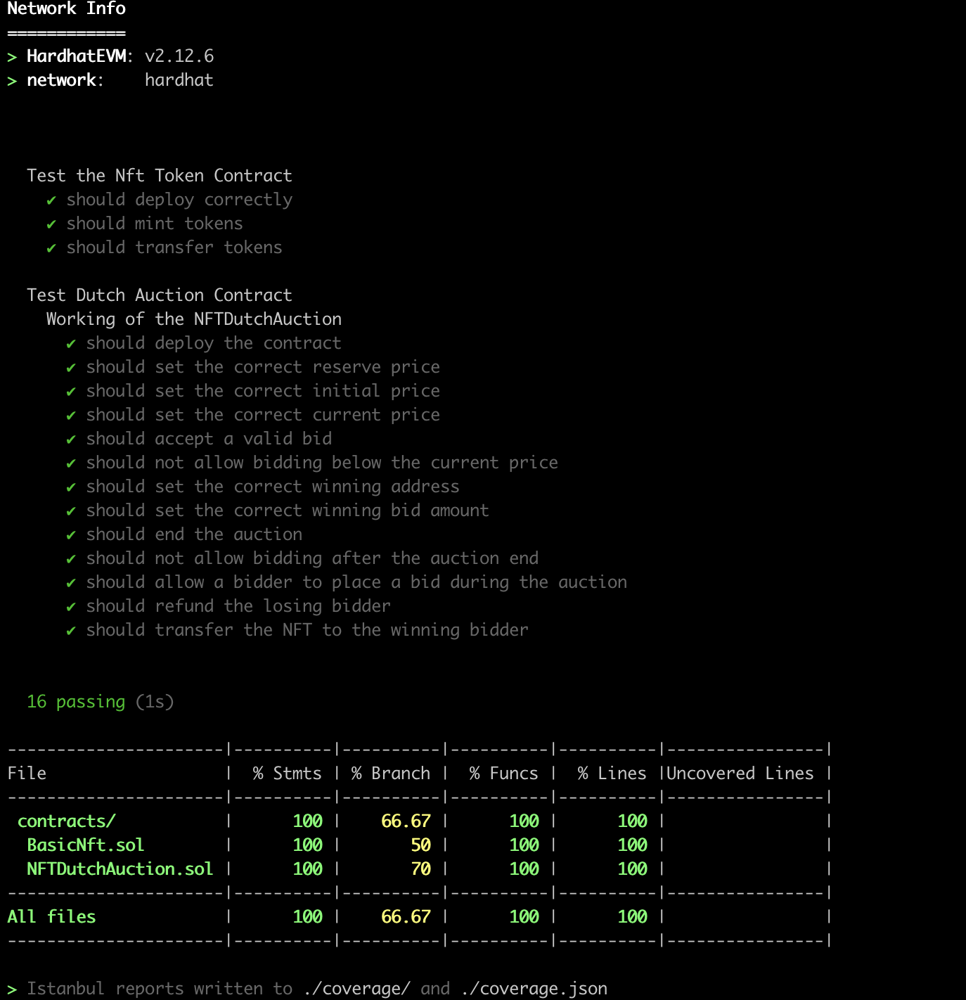

# Basic Dutch Auction - Assignment 1
### Name: Arjun Raja Yogidas
### NUID: 002964082

The NFTDutchAuction.sol contract works as follows:

- The seller instantiates a DutchAuction contract to manage the auction of a single, physical item at a single auction event. The contract is initialized with the following parameters: 
    -  reservePrice: the minimum amount of wei that the seller is willing to accept for the item 
    - numBlocksAuctionOpen: the number of blockchain blocks that the auction is open for
    - offerPriceDecrement: the amount of wei that the auction price should decrease by during each subsequent block. 
- The seller is the owner of the contract. 
- Nft's are minted by the owner here for reduced comlexity
- Nft contract approves the required addresses for the auction to continue uninterupted
- The auction begins at the block in which the contract is created. 
- The initial price of the item is derived from reservePrice, numBlocksAuctionOpen, and  offerPriceDecrement: initialPrice = reservePrice + numBlocksAuctionOpen*offerPriceDecrement 
- A bid can be submitted by any Ethereum externally-owned account. 
- The first bid processed by the contract that sends wei greater than or equal to the current price is the  winner. The wei should be transferred immediately to the seller and the contract should not accept  any more bids. All bids besides the winning bid should be refunded immediately. 


To run the project, clone this repository and run the following commands:

```shell
npx hardhat compile //to compile
npx hardhat run scripts/deployBDA.ts //to deploy
npx hardhat test //to run test cases
npx hardhat coverage //to generate coverage report
```

## Test Coverage Report

